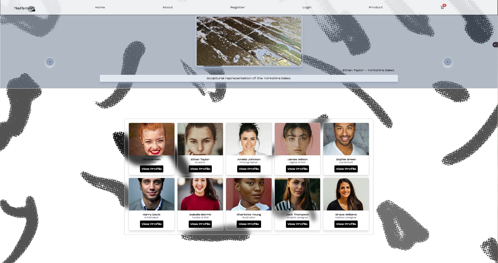
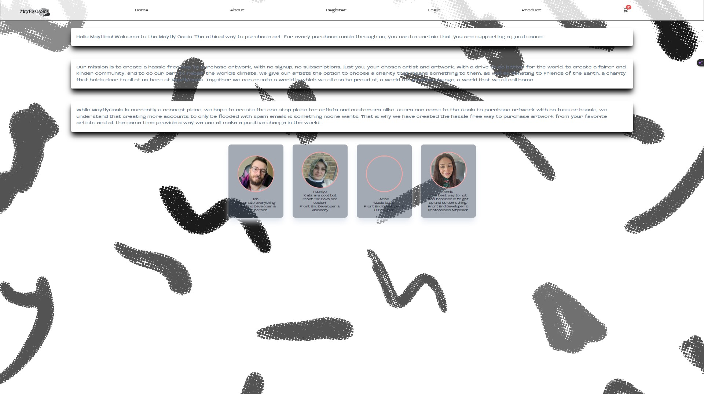
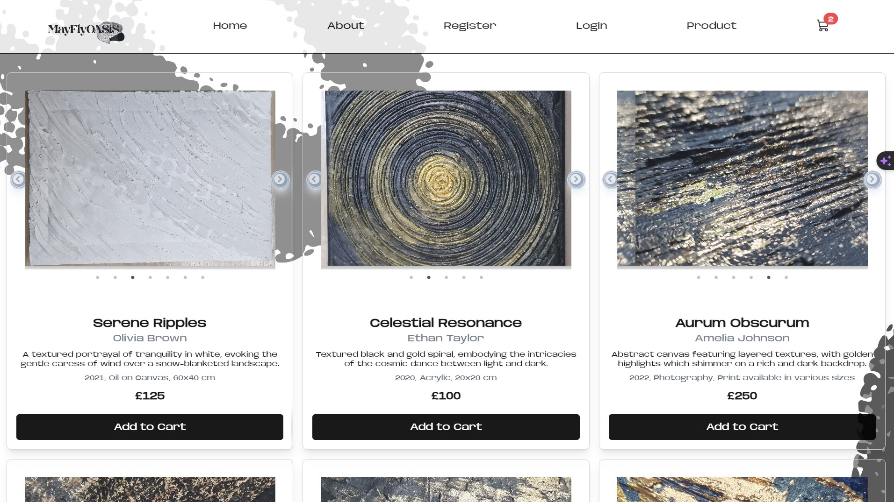
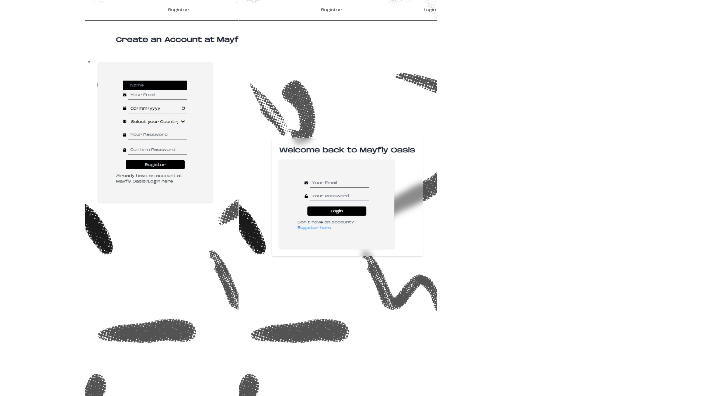
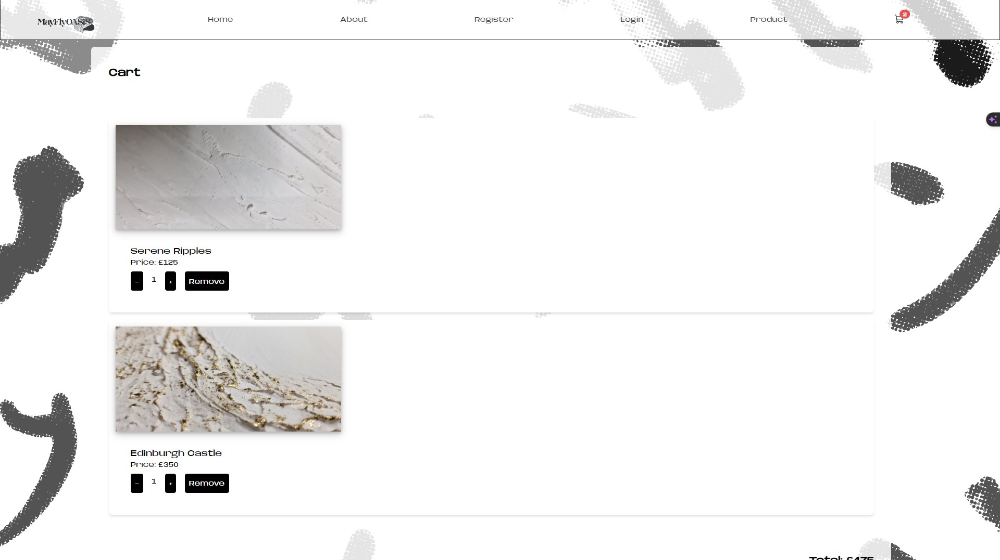

# mayflyOasis


## Description
The project opens doors for artists to create their own unique havens, where they can effortlessly manage their art, exhibitions, and sales. It's a space tailored to their needs, offering a platform where their creativity can shine. Moreover, it's built with the utmost respect for the privacy and security of both artists and buyers. Artists can confidently showcase their work and conduct business, knowing that their personal information remains safeguarded. Buyers, in turn, can explore and purchase artworks without any worries about their privacy or security being compromised. It's a space designed to empower both artists and art enthusiasts alike, fostering a vibrant and secure community for creative exchange.

## Table of Contents
* [Description](#description)
* [Deployment](#deployment)
* [Demo](#demo)
* [Screenshot](#screenshot)
* [Languages](#languages)
* [Usage](#usage)
* [Contributors](#contributors)
* [Testing](#testing)
* [Author](#author)
* [Repository](#repository)
* [Questions](#questions)

## Demo
https://mayflyoasis.netlify.app/

## Screenshot
<p>Output of the project in gif format</p>


<br>
<p>Output of the project in image format</p>
<br>








## Languages
HTML, CSS,JavaScript, React JS
## Usage
This project can be used The project has been carefully put together to showcase an expert level of skill in React.jsx. This is evident in how these skills are applied seamlessly across a wide range of features. These features cover different needs, such as creating eye-catching profile cards, organizing art exhibits smoothly, simplifying artist registration, managing shopping carts efficiently, ensuring hassle-free checkout, and incorporating various other enhancements to enrich the overall user experience and functionality.

## Installation
Install mayflyOasis with ```npm install```, ```npm i react-router-dom ```, ```npm install -D tailwindcss postcss autoprefixer```, ```npm install react-icons```, ```npm i react-move```, ``` npm i yup```, ```npm i formik```
## Contributors
[@Jaycossey](https://github.com/Jaycossey)
[@annierizvi](https://github.com/annierizvi)
[@arionitas](https://github.com/arionitas)
[@tigerkaplan](https://github.com/tigerkaplan)
## Tests
n/a
## Author
[@Jaycossey](https://github.com/Jaycossey)
[@annierizvi](https://github.com/annierizvi)
[@arionitas](https://github.com/arionitas)
[@tigerkaplan](https://github.com/tigerkaplan)
## Repository
https://github.com/Jaycossey/mayflyOasis
## Questions
Please send your questions [here](mailto:jaycossey@live.com?subject=[GitHub]%20Dev%20Connect) or visit [github/https://github.com/Jaycossey](https://github.com/https://github.com/Jaycossey) for my other projects on GitHub.
